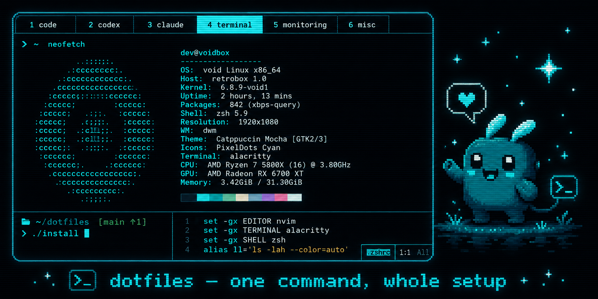

# dotfiles



One-command setup for a fresh Ubuntu/Debian machine: shell, terminal
multiplexer, editor, and AI coding tools — all symlinked back to this repo so
your config stays in version control.

| Component | What you get |
|-----------|--------------|
| **zsh** | Oh My Zsh, autosuggestions, syntax highlighting, Oh My Posh prompt |
| **tmux** | Custom config, TPM plugins, auto-started workspace with your tabs |
| **neovim** | Latest stable release + LazyVim configuration |
| **opencode** | OpenCode CLI with baseline config |
| **claude** | Claude Code CLI |

Base CLI tools (`git`, `curl`, `ripgrep`, `fzf`, `fd`, `btop`, `eza`, …) are
installed regardless of what you pick.

## Install

```bash
git clone https://github.com/majipa007/dotfiles.git ~/dotfiles
cd ~/dotfiles
bash install.sh
```

The installer is a guided TUI: pick components with arrow keys and space,
customize your tmux tabs, review a summary, then watch each step complete
with a ✓. Full command output goes to `/tmp/dotfiles-install.log`; on
failure the last lines are shown automatically.

Plain terminals (or `NO_COLOR=1`) get simple numbered prompts instead.
Existing config files are still backed up with a timestamp before anything
is symlinked.

### Unattended install

```bash
bash install.sh --all
```

`--all` (or `-y`) skips every prompt and installs everything with defaults.
Piped runs like `curl ... | bash` behave the same way, so the classic one-shot
bootstrap still works.

## The tmux workspace

New local terminals automatically drop you into a tmux session with your tabs
ready to go. The default layout:

| Tab | Name | Runs |
|-----|------|------|
| 1 | `code` | shell |
| 2 | `codex` | `opencode` |
| 3 | `claude` | `claude` |
| 4 | `terminal` | shell |
| 5 | `monitoring` | `btop` |
| 6 | `misc` | shell |

### Customizing tabs

Tabs live in `~/.tmux-workspace.conf` — created by the installer if you choose
custom tabs, or copy the template yourself:

```bash
cp tmux/tmux-workspace.conf.example ~/.tmux-workspace.conf
```

The format is one tab per line, `name` or `name:command`:

```ini
session_name=workspace
attach_existing=1

editor:nvim
serve:npm run dev
logs
monitoring:btop
```

Good to know:

- If a tab's command isn't installed, the tab opens as a plain shell instead
  of dying.
- `attach_existing=1` (default) means new terminals reattach to the existing
  session rather than spawning a fresh one each time. Set it to `0` for a new
  session per terminal.
- No config file at all? The launcher falls back to the default layout above.
- Edit the file any time — changes apply to the next session you start.

### Opting out

Add `export AUTO_TMUX=0` to `~/.zshrc.local` to stop terminals from
auto-starting tmux. You can still launch the workspace manually with
`start-tmux-workspace`.

## Machine-specific config

Secrets, tokens, and host-only paths belong in `~/.zshrc.local` — it's sourced
by `.zshrc` but never committed. See `zsh/.zshrc.local.example` for a starting
point.

## Repo layout

```
install.sh                        installer (interactive or --all)
zsh/                              .zshrc, .zprofile, .zshrc.local.example
tmux/                             .tmux.conf, workspace launcher + tab template
nvim/                             LazyVim config (linked to ~/.config/nvim)
omp-config/                       Oh My Posh theme
opencode/                         OpenCode config
```

## After installing

Restart your terminal or run `exec zsh`. That's it — the shell switches to
zsh, tmux starts with your tabs, and everything is linked back to this repo,
so `git pull` updates your config everywhere.
